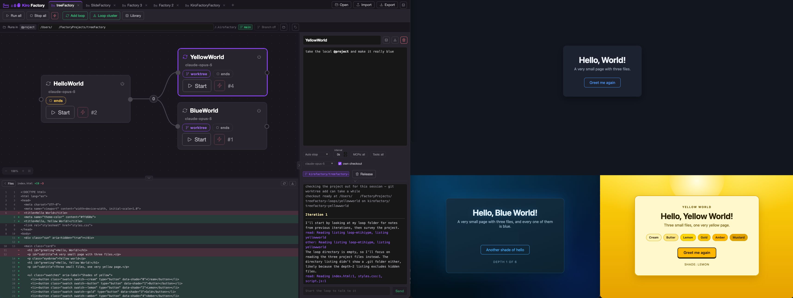

# Kiro as a Software Factory

**Graph engineering for Kiro: a factory of agent loops.** A loop is a prompt that runs turn after turn as a `kiro-cli` session. You place loops on the factory floor, wire them together, and press start. The wires are folders on disk: one loop writes a file, the next one picks it up atomically. Queues, topics and clusters shape the graph, each loop runs under an enforced tool grant, and it all lives in a directory you point it at. That is the whole system.

Every loop is a [Kiro](https://kiro.dev) session, which is where the name is earned rather than borrowed.

## The factory

[](resources/kiro-factory-screen.png)

## Run it

This is sample code, meant for exploration and demonstration, not production code.

```bash
./setup.sh   # install and build, once
./run.sh     # build and serve
```

Then open `http://127.0.0.1:4711`. [Kiro](https://kiro.dev) needs to be on your PATH, since every loop is a `kiro-cli` session. Node 20.19 or newer (or 22.12+).

Set `LOOP_DRIVER=echo` to run the machinery without calling a model, which is useful for watching how work moves without spending anything. `PORT` and `HOST` move the server, and the rest of what can be set is in [the HOWTO](HOWTO.md#environment).

## The model, in one paragraph

A loop is a name and a prompt; each turn is a fresh Kiro session, so its memory is what it leaves on disk. A wire is a folder: an item is a small JSON file, and taking one *moves* it out - the rename is atomic, so two loops racing for the same item cannot both get it. The move is the agent's own `mv`, which is why a consumer needs `shell`; the default grant has it. A producer's wires deliver as one shared **queue** or as a **topic** with a copy per subscriber. A component can be a **cluster** instead of a single loop, running the same prompt in several sessions at once which compete over that one queue, optionally reading each other around a ring. A loop takes turn after turn until you stop it, or until the run mode you picked ends it: when its agent judges the work finished, when the queue runs dry, or at a cap on turns or hours. Every factory runs in a base directory, its loops write anywhere below it, and the directory bar says what git makes of that - including branching a factory off into its own worktree, or giving every session of one loop a checkout and a branch of its own so parallel work is genuinely parallel.

Prompts are written with `@names`: `@input` and `@output` for the queues, `@project` and `@loop` for the directories, `@some-server` for a tool, and a name of your own for a **parameter** - a value set once on the directory bar that every prompt in the factory can write, and that can be changed between runs without editing a prompt.

The full tour - queues and topics, how a run ends, clusters, scoping a loop's tools and model, parameters, a checkout per session, the file and changes panels, prompts, the library, what lands on disk - is in **[HOWTO.md](HOWTO.md)**. Reusable loops, clusters and whole factories live in [`library/`](library/).

## What a loop is trusted with

**A new loop starts with every built-in tool except one, and with no MCP servers.** The grant a loop is born with is `read`, `write`, `search`, `code`, `shell`, `web`, `knowledge`, `todo_list` and `introspect` - nine of the ten the panel offers - and **no MCP servers**. `shell` is in because the factory model needs it: taking an item off a queue is a move, `write` can create, edit and delete a file but not rename one, and a consumer that cannot move an item cannot claim it. An earlier default left `shell` out as the blast radius, and what it bought was a default at which no loop could take part in a queue. `subagent` is the one row left out: it is a way to get a second agent whose own grant nobody has looked at, and it is the tick this default exists to make you make on purpose. MCP servers are out because they are where credentials tend to live, and because a prompt that names one with `@` gets it anyway.

The grant is enforced, not requested. It is handed to `kiro-cli` as the generated agent's tool list, so a loop without `shell` does not have one - the agent cannot decide otherwise.

**So read the default for what it is.** A loop at the shipped grant can run `npm run build`, `git commit`, a migration, or `rm -rf`, inside the directory you pointed it at and with the credentials of the shell that started the server, and nobody will ask you first. The [`KiroFactoryFactory`](library/factories/kirofactoryfactory.json) in the library compiles this app at that grant, which is the point; it also means the directory you give a factory should be one you would give an unattended contractor with a terminal. Narrow a loop that does not need commands - the one that only rewrites text - by opening `Tools` and unticking `shell`; it will then have none.

**The panel tells you this the first time.** A loop still carrying the grant it was born with shows a small note above its `MCPs` and `Tools` chips - *Set which tools and MCP servers this loop may use*, with a `Keep` beside it. It appears for a loop you add and for every loop of a factory you take out of the library, and it names only the half you have not decided yet. Clicking the note, or opening either list, puts it away for that loop. Clicking `Keep` says the default is fine: it saves the shipped grant as your default for each half you had not decided, and the note does not come back on any loop on this machine. Nothing enforces that you read it; it exists so that the grant a loop runs with is something you saw once.

**If the default is wrong for the way you work, change it once.** Set a loop's `Tools` or `MCPs` to what you actually want and a `Save as default` appears above that chip; click it and every new loop starts there. The two are saved separately - keeping your servers says nothing about your tools - and the choice is yours rather than the project's: it lives in `~/.kirofactory/grants.json` and applies in every factory you open on this machine, so a factory you export carries no opinion about what somebody else's agents may do. Saving also silences the note, on the reasoning that somebody who has set a default has thought about the question; `Keep` is the same act for somebody whose answer is the shipped grant. `Tools: all` is a legitimate thing to save, and the point of saving it is that it becomes a decision somebody made rather than the absence of one. To go back, remove that key from `grants.json` - or delete the file for both - which returns the axis to the shipped grant and brings the note back with it.

The ten grants are read, write, search, code, shell, web, subagent, knowledge, todo_list and introspect; tick a loop down to any of them and it gets exactly those. The same applies to MCP servers, per loop, with one exception worth knowing: a server the prompt names with `@` is granted whether or not the list mentions it, because a prompt that says `@pricing` must never run against an agent that does not have it. See [the HOWTO](HOWTO.md#what-a-loop-may-use).

What is *not* configurable from the UI is approval, and this is the reason the grant matters as much as it does. Within whatever a loop has been granted, calls run unattended: **no human confirms a write, a shell command or a delete mid-run.** That is what makes it a loop rather than a chat, and it means a running loop should be read as something holding your shell inside its working directory. Point factories at a dedicated, version-controlled directory, and expect files there to be created, changed and removed without being asked. Auto-approval is a flag and a kind list at the top of `app/server/acp.ts` if you want a narrower default for every loop at once.

**Loops inherit the environment of the shell that started the server.** Anything exported there - cloud credentials, API tokens - is visible to every agent the app runs. Start it from a shell that holds nothing you would not hand to an unattended agent, and in particular not one carrying production credentials.

## The agent reads the project, and the project can talk back

Skills and steering files under the project directory are read fresh every turn and loaded into the agent's context. That is the feature: a repository can teach the loops working on it. It is also the exposure, because those files are instructions and they are not yours if the repository is not yours. **A `SKILL.md` or a steering file in a cloned third-party project can steer a loop that holds shell and delete.** Point factories at code you trust, or run the whole thing in a container where the blast radius is one you chose.

The same caution applies to anything a loop *fetches* or reads out of a queue: text arriving from outside the factory is data, not instruction, but an autonomous agent is the wrong place to be relaxed about the difference.

`@loop` and `@project` scope the directories a prompt talks about, and `@names` scope tools. Both are stated to the agent, and the tool grant is enforced by `kiro-cli`, but the directory scoping is a request in a prompt rather than a sandbox: nothing stops a granted shell from walking somewhere else on disk. Treat the working directory, and the environment the server was started from, as the real boundaries.

## The server

The server binds loopback, which is most of what stands in for authentication: only this machine can reach it. Three things cover the rest, since "this machine" includes the browser tab next to this one and every other process on the box.

Requests must arrive with a loopback `Host`, and must not carry a foreign `Origin` or a cross-site `Sec-Fetch-Site`, so a page on another site cannot drive the API and a rebound DNS name cannot pretend to be local. Anything that changes something must also carry an `x-kirofactory` header holding **a token generated fresh at every start**, which the server writes into the page it serves and prints on the console. A page from elsewhere cannot set that header at all, and another process on this machine cannot guess the token. Reads are not asked for it - an export link and an event stream cannot send headers, and a process running as you can read those files without asking us to. And `HOST` alone will not publish the server: a non-loopback bind is refused unless `KIROFACTORY_ALLOW_REMOTE=1` says so too.

Restarting the server invalidates open tabs, which they handle by reloading themselves once to pick up the new token. To drive the API by hand, copy the token from the startup output.

Even so, this is a local development tool. There is no user model and no audit trail, and the endpoints start agents. It is not meant to be exposed to a network, and putting it on one puts unattended shell access there with it.

## License

Apache License 2.0. See [LICENSE](LICENSE).

**Author:** Ivo Kammerath<br>
**Reviewer:** Ben Freiberg, Martin Karrer
